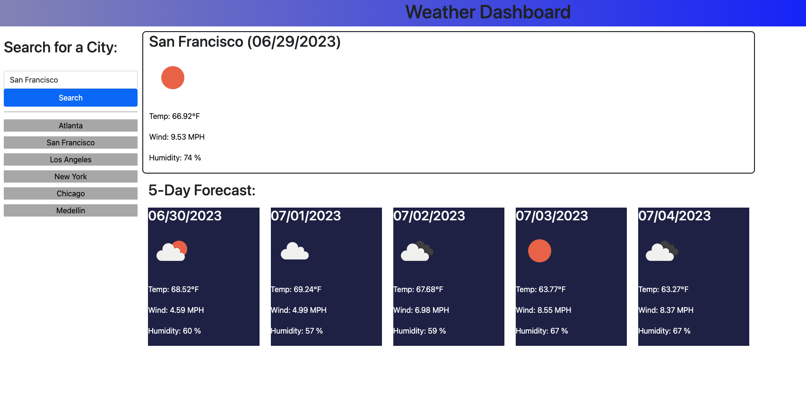

# weather-dashboard

## Description

This webpage displays the current weather as well as the 5 day forecast when any city is searched in the search bar. The purpose of building this webpage was to gain experience using Javascript to retrieve live data using Server Side APIs. This page allows a user to search the weather forecast for any city in the world. The site will also save previous searches so a user can easily switch between popular cities.

## Installation

No installation is required to use this webpage.

## Usage

You can access the webpage using this [Link](https://dhclarke99.github.io/weather-dashboard/).

Type any city into the search bar and click "submit" to retrieve live weather data. Refresh the page to view any previous searches. Click on any previous searches to retrieve the latest weather data.

  
   

